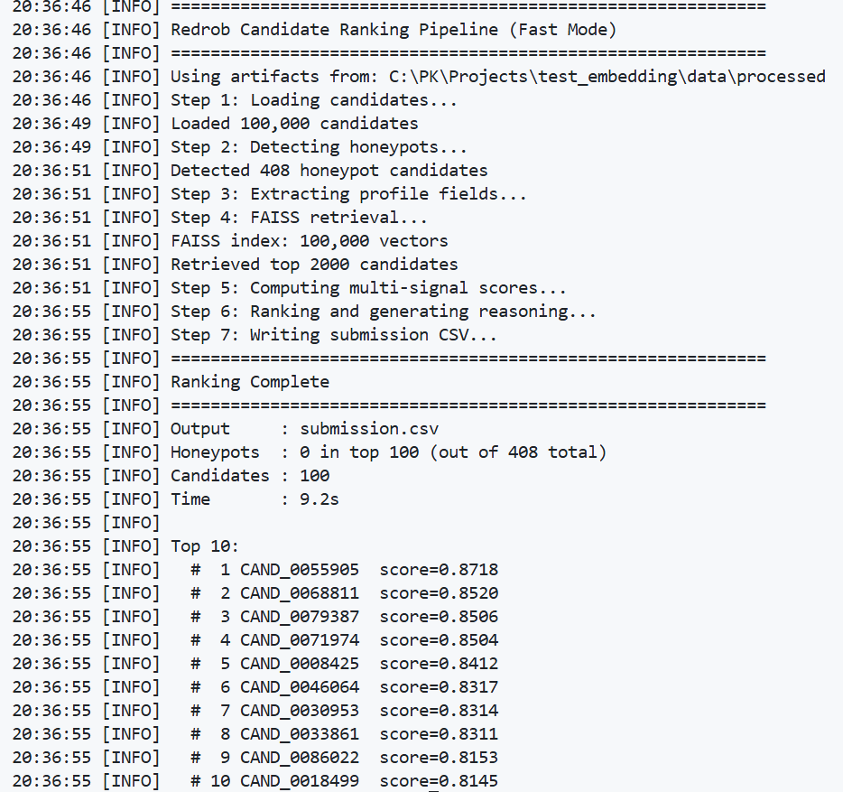

# Redrob Intelligent Candidate Discovery & Ranking Challenge

Candidate ranking system for the Redrob Hackathon v4.

## Quick Start

```bash
# 1. Install dependencies
pip install -r requirements.txt

# 2. Run the ranking pipeline (<30 seconds on CPU)
python rank.py --candidates ./data/processed/candidates.parquet --out ./submission.csv
```

The submission CSV will be produced at `./submission.csv`.

### Pre-computation (if needed)

The FAISS index and embeddings in this repo are pre-computed. If you need to
regenerate them (e.g., after changing the embedding model):

```bash
# Takes ~15 min on GPU for 100K candidates — only run once
python precompute.py --candidates ./data/processed/candidates.parquet
```

### Outputs

| File | Description |
|------|-------------|
| `submission.csv` | Top 100 ranked candidates with reasoning |
| `honeypots.csv` | Detected honeypot candidates from top 100 with reasoning |

## Architecture



```
rank.py                    # Unified entry point (THE command to reproduce)
├── Honeypot detection     # Filters impossible profiles (408 detected)
├── FAISS retrieval        # Inner-product search → top 2000 candidates
├── Multi-signal scoring   # 11 scoring signals combined
├── Reasoning generation   # JD-aware candidate justification
└── Honeypot export        # Saves honeypots from top 100 to honeypots.csv
```

### Scoring Signals

| Signal | Weight | Description |
|--------|--------|-------------|
| Embedding similarity | 0.35 | Cosine similarity to JD embedding |
| Experience years | 0.10 | Sweet spot: 5-9 years |
| Retrieval experience | 0.10 | Search/ranking/IR keywords in career |
| Production deployment | 0.10 | Shipped/live/deployed signal |
| Company type | 0.08 | Product vs service company history |
| Availability | 0.07 | Open-to-work, notice period, response rate |
| Skill match | 0.05 | Direct alignment with JD required skills |
| Skill assessment | 0.05 | Redrob platform assessment scores |
| Title relevance | 0.05 | Current title/headline AI/ML relevance |
| LLM experience | 0.03 | LLM-related keywords and skills |
| Research presence | 0.02 | Moderate research is good; pure research penalized |

## Compute Constraints

### Pre-computation (once)
- Runtime: **~15 minutes** on GPU
- Generates embeddings, FAISS index, JD embedding

### Ranking step (per run)
- Runtime: **<30 seconds** wall-clock
- Memory: ≤ 16 GB RAM
- CPU only — no GPU required
- No network calls during ranking
- Disk: ≤ 5 GB intermediate state

## File Structure

```
├── rank.py                              # Main entry point
├── precompute.py                        # One-time pre-computation
├── config.py                            # Configuration constants
├── requirements.txt                     # Python dependencies
├── README.md                            # This file
├── submission_metadata.yaml             # Portal metadata
├── submission.csv                       # Top 100 ranked candidates
├── honeypots.csv                        # Honeypots from top 100
├── .gitattributes                       # Git LFS config
│
├── data/
│   ├── raw/
│   │   ├── candidates.jsonl             # Original dataset (gitignored, 465 MB)
│   │   ├── candidate_schema.json        # JSON schema for candidates
│   │   ├── sample_candidates.json       # 10 sample candidates
│   │   ├── sample_submission.csv        # Format reference
│   │   ├── submission_metadata_template.yaml
│   │   └── validate_submission.py       # Submission validator
│   │
│   └── processed/
│       ├── candidates.parquet           # Compact candidate data (14 MB)
│       ├── candidates_with_profiles.parquet  # Preprocessed profiles (19 MB)
│       ├── candidate_index.faiss        # FAISS index (147 MB, Git LFS)
│       └── jd_embedding.npy             # Job description embedding (1.6 KB)
│
│   └── img/
│       └── rank_pipeline.png            # Pipeline architecture diagram
│
└── docs/
    ├── job_description.docx             # Target job description
    ├── README.docx                      # Original docs
    ├── redrob_signals_doc.docx          # Signal documentation
    └── submission_spec.docx             # Submission specification
```

### Large Files

| File | Size | Storage |
|------|------|---------|
| `candidates.parquet` | 14 MB | Regular git |
| `candidates_with_profiles.parquet` | 19 MB | Regular git |
| `candidate_index.faiss` | 147 MB | Git LFS |
| `jd_embedding.npy` | 1.6 KB | Regular git |

`candidates.jsonl` (465 MB) and `candidate_embeddings.npy` (147 MB) are
gitignored — they are not needed by the ranking pipeline.

## Validation

```bash
python data/raw/validate_submission.py submission.csv
```

Checks:
- Exactly 100 data rows
- Valid CAND_XXXXXXX IDs
- Unique ranks 1-100
- Non-increasing scores
- Tie-breaking by candidate_id ascending
